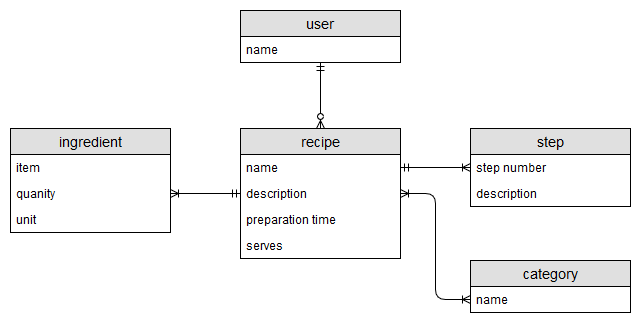
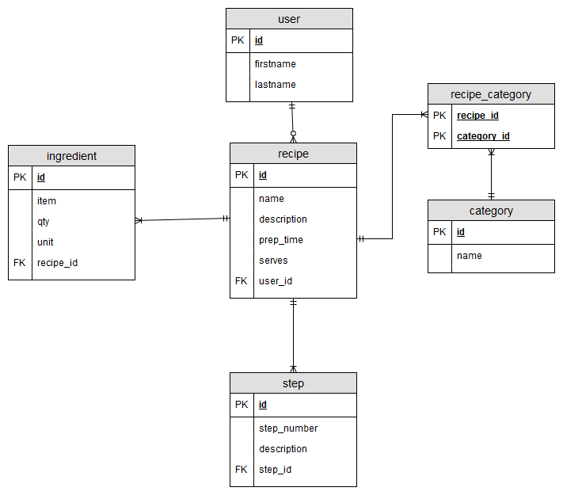

# Recipe Database

This is a super simple database for storing recipes.

## Entities

* user
* recipe
* ingedients
* steps
* category

## Logical Model

### Assumptions

* each ingredient is a new record which belongs to a single recipe
* at this level the units of measurement are part of the ingredient table. It could be seperated into its own referenece table.

## Physical Model

## Data Dictionary